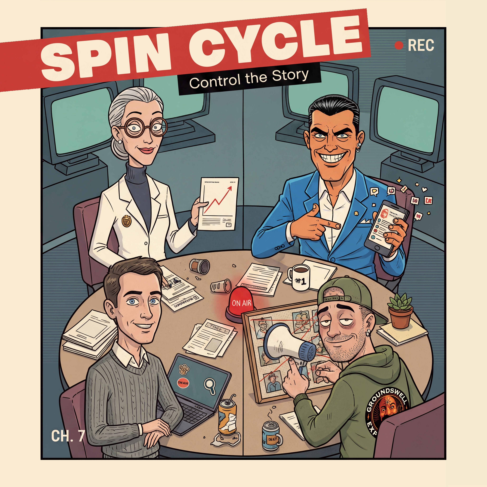

# Spin Cycle

<p align="center">
  
</p>

<p align="center"><strong>Control the story before the story controls you.</strong></p>

Spin Cycle is a Jackbox-style party game about influence, timing, and chaos. One player runs the host screen, everyone else joins on their phone, and teams fight to steer public opinion in opposite directions.

It starts simple: A bizarre world event hits the room, each faction gets a private brief, and the clock starts ticking. Then things get loud fast, because every team wants a different public mood and only one move gets locked in per faction each round.

So yes, it is strategic, but it is also social! People debate wording, pitch wild ideas, and watch the results reveal together when the round resolves.

## How a round feels

1. A new escalation lands and your briefing arrives.
2. Your team picks one move and writes the content together.
3. The faction submission locks and the round closes.
4. The game scores quality and impact.
5. The narrative advances, sentiments shift, and the next round gets tougher.

## One example moment

In **The Raccoon Economy**, a colony of tie-wearing raccoons takes over an Ohio bank and starts approving mortgages at absurd rates. Your team has one short window to turn that chaos into a message that helps your faction win the mood war.

## Why it works in a group

Rounds are short, so everyone stays engaged. Factions have distinct personalities, so teams naturally roleplay. Because outcomes are revealed on the main screen, every round ends with a shared reaction and a fresh argument about what to do next.

## Game design snapshot

- 4 competing factions, each with different scoring incentives
- 5 public sentiment axes that define the state of the world
- Credit economy with action costs and tradeoffs
- 4-round structure with escalating consequences
- Big-screen host flow plus phone-first player experience

## Tech overview

- Frontend: React 19, TanStack Router, TanStack Query
- Backend and realtime state: Convex
- Briefing and scoring generation: OpenRouter
- Generated intro videos for later rounds: FAL

## Running locally

```bash
pnpm install
pnpm dev
pnpm build
```

Minimal environment requirements:

- `CONVEX_DEPLOYMENT` and `VITE_CONVEX_URL` for Convex deployment and client connection
- `OPENROUTER_API_KEY` for briefing and scoring generation
- `FAL_KEY` for generated intro videos in later rounds (if missing, the game continues without generated clips)

Maintainer note: after editing YAML game config, regenerate derived data with `pnpm game-data`.
